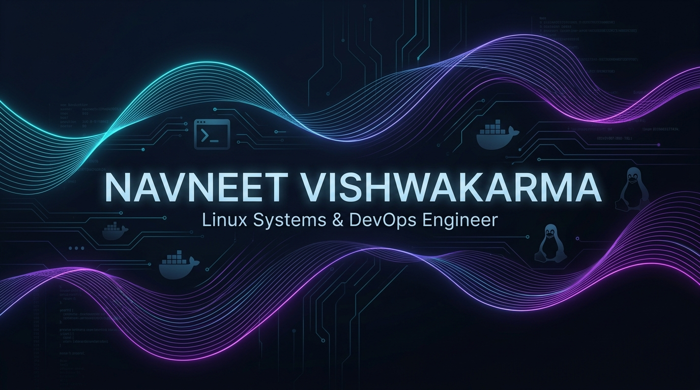

  

   

  

  

    <em>Building dependable systems, hardening Linux servers, automating infrastructure, and driving SRE practices.</em>
  

  

    
    &nbsp;
    
    &nbsp;
    
    &nbsp;
    
    &nbsp;
    
    &nbsp;
    
  

---

## 👨‍💻 Professional Summary

<table>
  <tr>
    <td width="65%" valign="top">
      

        I am a <strong>Computer Science Engineering student</strong> with a strong focus on <strong>Linux System Administration</strong>, <strong>Technical Support</strong>, and <strong>Infrastructure Management</strong>.
      

      

        I possess hands-on industry experience working with enterprise Linux environments including <strong>SUSE Linux Enterprise Server (SLES)</strong>, <strong>Ubuntu</strong>, and <strong>openSUSE</strong>. My core expertise covers system administration, troubleshooting, log analysis, shell scripting, server hardening, configuration management, and automation using <strong>Ansible</strong> and <strong>SaltStack</strong>.
      

      

        I thrive on solving complex technical challenges, investigating production issues through root-cause analysis (RCA), and continuously strengthening system reliability and security. Currently open for roles as:
         
        🎯 <strong>Linux System Administrator | Linux Support Engineer | Technical Support Engineer | Infrastructure Support Engineer | Junior DevOps Engineer</strong>
      

      <ul>
        <li>📍 <strong>Location:</strong> Satna, Madhya Pradesh, India</li>
        <li>🎓 <strong>Education:</strong> B.Tech in CSE — AKS University, Satna</li>
        <li>📬 <strong>Contact:</strong> <a href="mailto:rajvl132011@gmail.com">rajvl132011@gmail.com</a></li>
      </ul>
    </td>
    <td width="35%" align="center" valign="middle">
      
    </td>
  </tr>
</table>

---

## 💼 Work Experience

### 🏢 **OS3 Infotech Pvt. Ltd.**
**Trainee System Engineer Intern**  
*January 2026 – April 2026 (4 months) | Navi Mumbai*

- 🐧 **Linux Server Management:** Managed Linux-based systems and enterprise server environments for critical internal applications and business operations.
- 🔍 **Incident Resolution & RCA:** Performed real-time system monitoring, troubleshooting, deep log analysis, and issue resolution to ensure high service availability.
- ⚙️ **Configuration & Deployment:** Assisted in server configuration, system provisioning, package management, and system administration across Linux distributions.
- 📜 **Automation with Shell & Ansible:** Utilized shell scripting and **Ansible** for configuration management, automating routine operational maintenance and repetitive admin tasks.
- 🛡️ **Security Hardening:** Implemented Linux security best practices, system updates, user access controls, and routine patch maintenance.
- 🐳 **Docker Environments:** Maintained and managed Docker-based environments for seamless application deployment and testing workflows.
- 🌐 **Infrastructure & Hosting:** Supported core infrastructure maintenance, application hosting, and website management activities.
- 📝 **Documentation & SOPs:** Authored comprehensive technical documentation, troubleshooting playbooks, and standard operational procedures (SOPs).

 

### 🏢 **Codenixia**
**Cloud & DevOps Engineering Intern**  
*September 2025 – December 2025 (4 months) | Remote*

- ☁️ **AWS Cloud Services:** Provisioned and managed AWS infrastructure including compute services (EC2), networking (VPC, Subnets, Security Groups), and storage (S3).
- 🚀 **CI/CD Pipelines:** Built and deployed automated continuous integration and continuous delivery (CI/CD) pipelines to streamline software releases.
- 🐧 **Linux Administration:** Handled Linux server deployment, process lifecycle management, networking configurations, and performance optimization.
- 🛠️ **DevOps & Automation:** Developed and tested practical cloud projects using modern DevOps methodologies, Git, and automated shell scripts.
- 📦 **Production Delivery:** Learned and applied production-ready deployment practices, infrastructure provisioning, and automation workflows.

---

## 🛠️ Technical Skills & Tools

### 🐧 Linux & Operating Systems

  
  
  
  
  
  

### ⚙️ Automation & Configuration Management

  
  
  
  
  

### ☁️ Cloud, Containers & CI/CD

  
  
  
  
  

### 💻 Developer Tools & Environments

  

---

## 🚀 Featured Projects

<table>
  <tr>
    <td width="50%" valign="top">
      <h3>🛡️ Enterprise Linux Server Hardening (Ansible & Bash)</h3>
      
Automated security baseline hardening solution enforcing industry-standard security policies across Linux fleets.

      <ul>
        <li>Automated CIS-aligned baseline configuration playbooks</li>
        <li>Firewall (UFW / Firewalld) policy automation & SSH lockdown</li>
        <li>Privilege access restriction, password policies, and auditd rules</li>
        <li>Zero-touch idempotent deployment across multi-node servers</li>
      </ul>
      
<strong>Skills:</strong> <code>Ansible</code> <code>SUSE Linux</code> <code>Bash</code> <code>Security Hardening</code>

      

        
      

    </td>
    <td width="50%" valign="top">
      <h3>🔍 Infrastructure Monitoring & Incident Investigation (RCA)</h3>
      
Hands-on operational framework simulating production incidents, telemetry analysis, and remediation playbooks.

      <ul>
        <li>Systemd journal, kernel logs, and dmesg deep diagnostic pipeline</li>
        <li>Root Cause Analysis (RCA) templates and post-mortem documentation</li>
        <li>Automated alerting scripts for memory, CPU, and disk threshold breaches</li>
        <li>Preventive maintenance runbooks for sustained uptime</li>
      </ul>
      
<strong>Skills:</strong> <code>Log Analysis</code> <code>Troubleshooting</code> <code>Linux SRE</code> <code>Bash</code>

      

        
      

    </td>
  </tr>
  <tr>
    <td width="50%" valign="top">
      <h3>☁️ AWS Cloud Infrastructure & Automated Deployment</h3>
      
Production-ready infrastructure deployment lab implementing secure cloud networking and compute on AWS.

      <ul>
        <li>Custom VPC architecture with isolated public/private subnets and route tables</li>
        <li>Automated EC2 provisioning and security group least-privilege configurations</li>
        <li>S3 storage policies and IAM role-based permission management</li>
        <li>Automated shell setup scripts for web server and application hosting</li>
      </ul>
      
<strong>Skills:</strong> <code>AWS</code> <code>Cloud Architecture</code> <code>EC2 / VPC / S3</code> <code>Networking</code>

      

        
      

    </td>
    <td width="50%" valign="top">
      <h3>🐳 Multi-Stage Docker & GitHub Actions CI/CD Pipeline</h3>
      
Continuous integration and delivery workflow automating build, test, and containerized deployment.

      <ul>
        <li>Optimized multi-stage Dockerfiles reducing image attack surface and size</li>
        <li>Automated GitHub Actions workflows for continuous build and lint verification</li>
        <li>Container lifecycle orchestration and automated environment verification</li>
        <li>Standardized deployment pipelines following modern DevOps best practices</li>
      </ul>
      
<strong>Skills:</strong> <code>Docker</code> <code>CI/CD</code> <code>GitHub Actions</code> <code>YAML</code>

      

        
      

    </td>
  </tr>
</table>

---

## 🏅 Certifications & Training

- 📜 **NCVET** — Junior Software Developer
- 🏆 **Hackverse 5.0** — Competitive Hackathon Achievement
- 💼 **Goldman Sachs** — Software Engineering Job Simulation
- 🛡️ **Goldman Sachs Engineering** — Security Assessment & Vulnerability Analysis
- 🤖 **Claude Code in Action** — AI-Assisted Engineering Workflows
- 🐧 **Linux Administration Training (CX-501)** — Codenixia
- 🔒 **Linux Server Hardening & Security Training (CX-701)** — Codenixia
- 🏢 **Trainee Systems Engineer Certificate** — OS3 Infotech Pvt. Ltd.
- 🇮🇳 **Skill India Certified** — Junior Software Developer (MERN Stack)
- 🎯 **Hackathon Finalist** — Thrilex 2024, AKS University

---

## 🔬 Research & Publications

  
  &nbsp;
  
  &nbsp;
  
  &nbsp;
  
  &nbsp;
  

 

<table>
  <tr>
    <td width="70%" valign="top">
      <h3>📄 Deep Learning & Biometric Security Systems (2 Research Items)</h3>
      

        <strong>Published Research:</strong> Co-authored IEEE-indexed research exploring deep learning algorithms for biometric security, presentation attack detection (anti-spoofing), and algorithmic vulnerability mitigation in facial recognition systems.
      

      <ul>
        <li><strong>Research Interest Score (9.7):</strong> Higher than <strong>65%</strong> of ResearchGate researchers who first published in 2024.</li>
        <li><strong>Engagement Breakdown:</strong> 41.5% Recommendations, 34.2% Full-text reads, 19.2% Other reads, 5.2% Citations.</li>
        <li><strong>Technical Contribution:</strong> Evaluated neural network robustness against physical presentation attacks (PAD) and built automated data validation pipelines in Python.</li>
      </ul>
      

        
      

    </td>
    <td width="30%" align="center" valign="middle">
      
        
      <strong>Navneet Vishwakarma</strong> 
      <em>Student Researcher @ AKS University</em>  
      
    </td>
  </tr>
</table>

---

## 🎓 Education

- 🏛️ **AKS University, Satna (M.P.)**  
  *Bachelor of Technology - BTech, Computer Science*  
  *(September 2022 – July 2026)*

- 🏫 **Government Excellence Higher Secondary School Venkat 01 Satna**  
  *Higher Secondary Education, Mathematics*  
  *(August 2020 – August 2022)*

---

## 📊 GitHub Analytics

  <table border="0">
    <tr>
      <td align="center">
        
      </td>
      <td align="center">
        
      </td>
    </tr>
  </table>

   

  

    

  

    

  <h3>📅 Contribution Activity Graph</h3>
  

---

## 🤝 Let's Connect

  
Open to discussions on Linux Administration, Cloud Infrastructure, SRE Practices, and DevOps Opportunities!

  
  &nbsp;
  
  &nbsp;
  
  &nbsp;
  
  &nbsp;
  

    

  <em>"Discipline, consistency, and hands-on practice build real engineering capability."</em>

    

  

